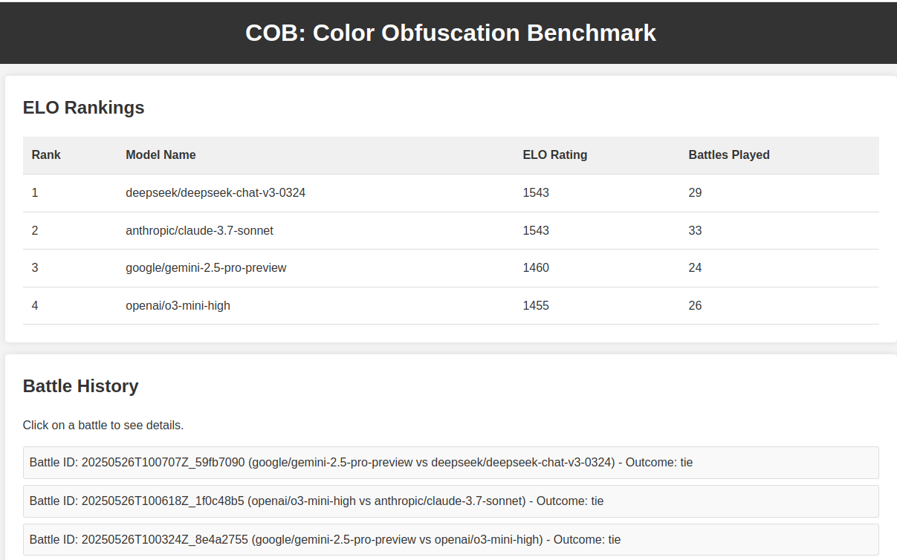

# Color Obfuscation Benchmark

It is common to hear the saying that intelligence is the act of information compression.

**Can information obfuscation also be a measure of LLM 'intelligence'?**

[ > Open the benchmark here! <](https://10decikelvin.github.io/cob)



## Project Overview

The core idea is to test how well one LLM (LLM1) can hide a piece of information (a hex color) in a way that an allied LLM (LLM2, same base model) can recover it, while an opposing LLM (LLM3, different base model) struggles to do so.


The benchmark involves repeating an arbitrary number of battles, with each battle lasting 2 rounds:

**Round 1:**
1.  **Obfuscation (LLM1):** Given a hex color, LLM1 generates an obfuscated string and a list of instructions for deobfuscation.
2.  **Deobfuscation (LLM2):** LLM2 (allied with LLM1 and using the same model as LLM1) uses the obfuscated string and instructions to recover the original hex color. This step primarily serves to validate LLM1's instructions.
3.  **Attack (LLM3):** LLM3 (opponent) attempts to recover the hex color from the obfuscated string. It gets 6 attempts, with an increasing percentage of LLM1's instructions revealed after each failed attempt.

**Round 2:**

The models swap roles (LLM1/2 <=> LLM3), and the process is repeated.

**Outcome:**

The model that is able to deobfuscate more colors across the two rounds 'wins' (ties are allowed). 

> **Note** 
> 
> The initial design was to gradually give the second model more and more hints to see how strong their 'guessing' abilities are but it turns out for most non-top tier models instruction following was already hard enough.

## General Technical Overview
- Backend responsible for the actual LLM executions done in python. Results are completely encapsulated in a `data.json` file.
- Frontend is in charge of ELO calculations and for visualisation. 
- Project code assisted by `gemini-2.5-pro-preview` with appropriate human intervention.

## Setup and Installation

1.  **Prerequisites:**
    *   Python 3.8 or higher.
    *   A virtual environment tool (e.g., `venv`).

2.  **Clone the Repository (if applicable):**
    ```bash
    git clone https://github.com/10decikelvin/cob.git
    cd llm-obfuscation-benchmark
    ```

3.  **Create and Activate a Virtual Environment:**
    *   Using `venv`:
        ```bash
        python -m venv venv
        source venv/bin/activate  # On Windows: venv\Scripts\activate
        ```

4.  **Install Dependencies:**
    ```bash
    pip install -r requirements.txt
    ```

5.  **Set Up Environment Variables:**
    *   Copy the example environment file:
        ```bash
        cp .env.example .env
        ```
    *   Edit the `.env` file and add your OpenRouter API key:
        ```
        OPENROUTER_API_KEY="sk-or-v1-YOUR_ACTUAL_API_KEY_HERE"
        ```
        Replace `"sk-or-v1-YOUR_ACTUAL_API_KEY_HERE"` with your actual key.

## Running the Benchmark

1.  **Configure Models (Optional):**
    *   Edit `config.py` to change the list of `LLM_MODELS` you want to benchmark. Ensure the model identifiers are valid for OpenRouter.
    *   You can also adjust `ELO_K_FACTOR`, `ELO_DEFAULT_RATING`, and other game parameters in `config.py`.

2.  **Run the Backend Script:**
    *   Execute the main Python script to start generating battle data:
        ```bash
        python benchmark.py
        ```
    *   The script will run continuously, selecting models, conducting battles, and saving results to `data.json`.
    *   Press `Ctrl+C` to stop the script. Data will be saved upon interruption.

3.  **View the Frontend:**
    *   Open the `index.html` file in your web browser (e.g., by double-clicking it or using a live server extension if you have one).
    *   The webpage will fetch data from `data.json` and display ELO rankings and battle histories.
    *   Refresh the page to see the latest data if the backend script is still running or has recently completed.

## File Structure

*   `benchmark.py`: The main Python script that runs the benchmark battles.
*   `config.py`: Configuration file for LLM models, ELO settings, and other parameters.
*   `requirements.txt`: Python dependencies.
*   `.env.example`: Example environment file for API keys.
*   `.env`: Your local environment file (ignored by Git if using version control).
*   `data.json`: Stores all battle data generated by `benchmark.py`. (Created automatically)
*   `data.example.json`: An example illustrating the structure of `data.json`.
*   `index.html`: The main HTML file for the frontend display.
*   `style.css`: CSS styles for the frontend.
*   `script.js`: JavaScript for fetching data, calculating ELO, and rendering the frontend.
*   `README.md`: This file.

## How ELO is Calculated

*   Each participating model starts with a default ELO rating (e.g., 1500).
*   After each battle, the ELO ratings of the two involved models are updated based on the battle's outcome (who won as LLM3, or if it was a tie).
*   The standard ELO update formula is used: `R_new = R_old + K * (S - E)`
    *   `R_new`: New rating
    *   `R_old`: Old rating
    *   `K`: K-factor (determines sensitivity of rating changes, configured in `config.py`)
    *   `S`: Actual score (1 for a win, 0 for a loss, 0.5 for a tie against the other model in the battle)
    *   `E`: Expected score (calculated based on the ELO difference between the two models)

## Customization

*   **Adding/Changing LLMs:** Modify the `LLM_MODELS` list in `config.py`. I was too broke to afford more credits on this,
*   **Frontend Appearance:** Modify `style.css` and `index.html`.
*   **Frontend Logic:** Update `script.js` for changes in data processing or display.

## License
Completely Open License. Copy it, sell it, do whatever you want.
